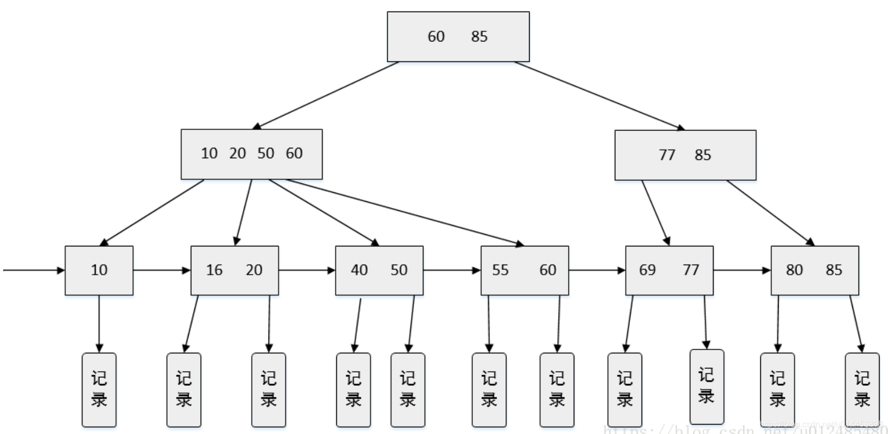
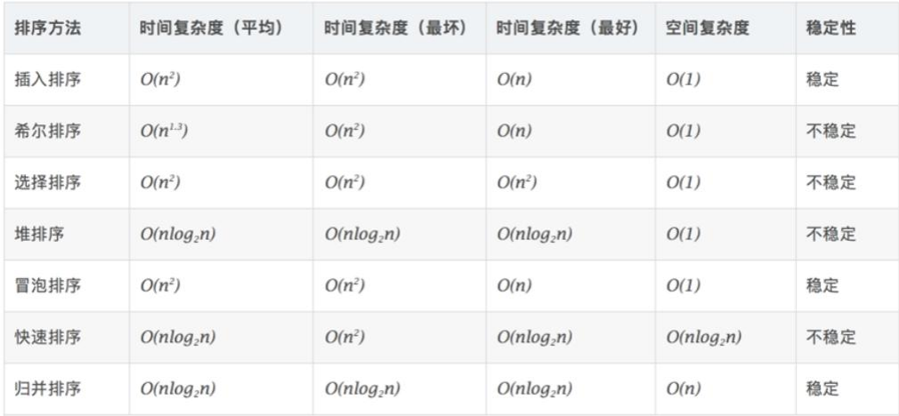

# 数据结构与算法

## 1 绪论

### 1.1 时间复杂度 ※※※

**主定理**：a为子问题的个数，b为每个子问题的规模缩小倍数，$f(n)$为除**递归外额外花费时间**。对于递推式：
$$
T(n)=aT(\frac{n}{b})+f(n)
$$

1. $f(n)$比子问题规模**小**，即$f(n)=O(n^{\log_ba-\epsilon})$：$T(n)=\Theta(n^{\log_ba})$
   - 例：二叉树遍历，$T(n)=2T(n/2)+O(1)$，时间复杂度$\Theta(n)$
2. $f(n)$和子问题规模**一样**，即$f(n)=O(n^{\log_ba})$：$T(n)=\Theta(n^{\log_ba}\log n)$​
   - 例：归并排序，$T(n)=2T(n/2)+\Theta(n)$，时间复杂度$\Theta(n\log n)$
3. $f(n)$比子问题规模**大**，即$f(n)=O(n^{\log_ba+\epsilon})$：$T(n)=\Theta(f(n))$
   - 例：$T(n)=2T(n/2)+\Theta(n^2)$，时间复杂度$\Theta(n^2)$​

大O：**最坏情况下的时间复杂度**。

- 例如对于二分查找，可以说时间复杂度$O(\log n)$，但不能$\Theta(\log n)$，因为最好情况一次就能找到$O(1)$​

### 1.2 数据的存储结构 ※※

顺序存储（随机存取，但增删耗时），链式存储（增删快，但不能随机存储）

索引存储（元素信息附加索引表），散列存储（根据元素关键字计算存储地址）

## 2 线性表

### 2.1 顺序表 vs 链表 ※※※

- **顺序表**——逻辑顺序 == 物理顺序
  - **优点**：可随机存取，快，存储密度大；**缺点**：增删慢，存储空间固定
- **链表**——逻辑顺序 != 物理顺序
  - **优点**：增删效率高，空间动态分配；**缺点**：不能随机存取，存储密度低

### 2.2 头指针和头结点的区别 ※※

- **头指针**：指向链表第一个节点的指针，链表为空时仍存在
- **头结点**：在第一个元素节点前，便于第一个元素的增删，**可有可无**

### 2.3 算法：查找单链表中倒数第k个结点 ※※※※※

方法：**快慢指针**，快指针先走k步，然后快慢指针同时走直到fast走到null，此时慢指针为倒数第k个

### 2.4 算法：判断链表有没有环 ※※※※※

方法：**快慢指针**，快指针走2步，慢指针1步。若快指针碰到尾则无环，否则二者一定会重合，有环。

## 3 栈、队列、数组

### 3.1 栈和队列的区别 ※※

**栈**：只许栈顶插入删除，先进后出

**队列**：只许队尾插入，在另一端删除，先进先出

### 3.2 共享栈 ※

让两个顺序栈共享一维数组空间，两栈底在两端，栈顶向共享空间中间延伸

### 3.3 区分循环队列空还是满 ※※

`Queue.front == Queue.rear`，队首和队尾位置重合

### 3.4 算法：栈在括号匹配中的思想 ※※

设置空栈顺序读入。若是左括号则进栈；若是右括号：此时栈空则失败，否则弹出栈顶左括号。

读完所有括号后栈空则成功，否则失败

### 3.5 算法：栈在后缀表达式中的思想 ※※

设置空栈顺序读入。所有项扫描完存放的是计算结果

- 若读入操作数，则进栈
- 若读入操作符`op`，则从栈中弹出两个操作数x和y，形成指令`x<op>y`再压栈

### 3.6 队列的应用 ※※

- 缓冲区管理：解决主机与外部设备之间**速度不匹配**的问题，例如打印机设置打印数据缓冲区
- 任务调度：CPU资源的竞争，每个请求排成队列

### 3.7 稀疏矩阵的存储 ※

使用三元组：`[i, j, val]`

## 4 串——KMP算法 ※※※

时间复杂度：$O(m+n)$

- 先计算`next`数组，`next[i]`表示子串`s[0:i]`的**最长公共前后缀**的长度，next数组只由子串得出
- 基于next数组，让子串和主串每个字符匹配。若匹配失效，则让子串滑动到next数组记录的前缀与后缀对齐的位置，主串指针无需回溯
- 若子串指针移到队尾，则匹配成功

## 5 树

### 5.1 二叉树、满二叉树、完全二叉树 ※※

树：每个节点都只有一个前驱结点，没有前驱结点的是根节点。二叉树：每个节点至多有两棵子树

**满二叉树**：除**最后一层**外，其他节点都有两棵子树（更严格）

**完全二叉树**：除**最后一层**外，其他节点数都达到最大值，且只在最右侧缺少节点

### 5.2 由遍历序列构造二叉树 ※※

**前序+中序**可以（前序的第一个节点就是根节点，以此类推）

**后序+中序**可以（后序的最后一个节点是根节点，以此类推）

**层次+中序**可以。但**前序+后序不能**唯一确定一棵二叉树

### 5.3 线索二叉树 ※

n个节点的二叉树，有n+1个空指针域（树退化为链表），将二叉树的所有空的左右指针指向某种遍历次序下该节点的直接前驱、后继节点，则得到的是线索二叉树

优点：可以快速查找节点的前驱和后继

### 5.4 二叉树的层次遍历

借助队列，根节点先入队。

循环。头结点出队，分别将它的左右节点入队（如有），直至队列为空

### 5.5 哈夫曼树（跟哈希没关系！）

又叫最优二叉树，在含有n个带权叶节点的二叉树中，**所有叶节点的带权路径长度之和最小的二叉树**是哈夫曼树

- **构造方法**：所有带权叶节点构成一个集合，每次选集合中两个权值最小的叶节点（子树，权值为叶节点之和）进行合并，直至只剩一个元素
- **应用**：哈夫曼编码，消除了编码前缀相同的二义性

## 6 图

### 6.1 图的存储结构 ※※

- **邻接矩阵法**：一维数组存顶点，二维数组存边的信息。适合稠密图
- **邻接表法**：顶点表存顶点，每个结点包括**节点值**和**出边表**。出边表包括顶点的所有出边

### 6.2 DFS BFS ※※※

- DFS：深度优先，访问起始顶点邻接的顶点，再访问它邻接点的邻接点，直至不能访问。递归
- BFS：广度优先，把起始顶点放入队列，依次取出队列中的所有顶点

### 6.3 最小生成树算法 ※※※

最小生成树：边权之和最小的生成树

**Prim算法**：任取顶点加入集合，找到与**当前集合所有点距离最近**的顶点，把该**点和对应边**加入集合，重复直至所有顶点加入集合。**适合稠密图**，$O(v^2)$，v为结点数

**Kruskal算法**：所有边**排序**，取最小边，**从小到大选边**，若加边后不构成回路则取之，否则弃之。**适合稀疏图**，$O(e\log e)$，e为边数

### 6.4 最短路径算法 ※※※

**Dijkstra算法**：单源最短路径，要求边权不为负，贪心。加堆优化后$O(n\log n)$

- 先将源点放入顶点集合，然后重复：**选取当前离源点最近的点**，加入集合，计算各点通过该集合到源点的距离，直至所有点放入集合

**Floyd算法**：多源最短路径，dp，$O(n^3)$

- 对于一对顶点i和j，看是否存在一点k，使得i到k再到j的路径比当前更短，若是则松弛（更新它）

- $c_{ij}(k)$​表示i到j，中间结点编号不超过k的最短路长度
  $$
  c_{ij}(k)=\min\{c_{ij}(k-1),c_{ik}(k-1)+c_{kj}(k-1)\}
  $$

### 6.5 拓扑排序

针对**有向无环图**（DAG）

- 思想：从图中选择**入度为0**的顶点输出，并删除该点和所有以它为起点的边，重复直至图为空
- 应用：工程中，有向边表示任务顺序，拓扑排序可确定总的任务顺序

## 7 查找

### 7.1 静态查找的方法 ※※

顺序查找，二分查找（要求有序），分块查找

### 7.2 二叉搜索（排序）树 ※※※

- 左子树所有节点值**小于**根节点值，右子树所有节点值**大于**根节点值，左右子树分别为二叉搜索树
- 二叉搜索树的**中序遍历**结果有序。时间复杂度平均$O(\log n)$，最坏$O(n)$

### 7.3 平衡二叉树 ※※

一种特殊的二叉排序树，左右子树高度差（平衡因子，左子树高度减去右子树高度）绝对值不超过1。插入时为保持平衡可能要进行**平衡旋转**

### 7.4 B树和B+树 ※※※※

**B树**：所有节点**平衡因子均等于0的多路平衡查找树**。阶数：一个节点最多有多少子树

- 一个节点**可按递增顺序存多个值**，一个节点有多个子树，所有叶节点在同一层
- 数据库查询可以减少树高，提升查询效率；但**不利于区间查找**（需要多次从根节点开始查找）

**B+树**：MySQL使用，是对B树的改进

- **叶节点之间有指针**，构成有序链表，可直接通过链表遍历进行**区间查找**
- 非叶节点在叶节点上**有冗余**，仅作为快速查找的索引

### 7.5 哈希表 哈希冲突

用哈希函数把关键字映射成地址加快查找速度

- 哈希冲突：两数经过哈希函数计算得到同一地址
- 可以把所有哈希地址相同的记录链接在同一链表中，也可以寻找新的空闲哈希地址

## 8 排序

### 8.1 冒泡、选择、插入排序

- 冒泡：遍历所有相邻两数，逆序则交换位置
- 选择：遍历所有数，找到第k小的数
- 插入：把元素逐个插入到已经有序的部分中

### 8.2 快速排序

- 基于分治，选择支点x，把数组划分为$A_L$（所有不大于x的元素）和$A_R$（所有大于x的元素）

- 移动支点使得$A_L$在其左边、$A_R$在其右边。

- 递归对$A_L$和$A_R$排序，直到规模为$O(1)$​

平均时间复杂度$O(n\log n)$，最坏情况$O(n^2)$，即每次支点都是最值。平均空间复杂度$O(\log n)$，最坏$O(n)$

### 8.3 归并排序，为何快排比归并好

- 基于分治，把数组划分为两部分，各部分递归排序再合并。$O(n\log n)$
- 快排为什么好？
  - **无需辅助空间**：快排就地排序，而归并排序需要额外空间
  - **缓存友好**：快排分区时处理的是局部连续空间，能充分利用CPU缓存
  - **平均时间复杂度更低**，**实现更简单**

### 8.4 各算法比较

### 8.5 排序的稳定性

稳定性：数组中值相等的元素，若排序后相对次序不变则稳定

- 稳定：插入、冒泡、归并
- 不稳定：选择、快排、堆

### 8.6 堆

堆：把所有元素按完全二叉树方式存储在一维数组，父节点比所有子节点大则为大跟堆

堆排序：把无需表转换为堆，每次提取出堆顶，剩下的重建堆

### 8.7 TopK问题

基于快排思想。将数组划分为两部分，左边元素都小于pivot，右边都大于pivot，若pivot的下标为k-1则找到了TopK。时间复杂度$O(n)$