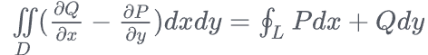
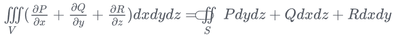
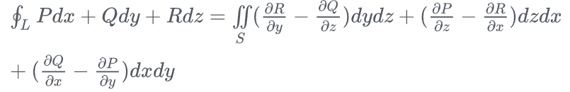

# 数学分析

[toc]

## 1 极限 导数定义 ※※

- **数列极限**：数列$\{a_n\}$，若对$\forall\epsilon>0$，总存在$N>0$，当$n>N$时有$|a_n-a|<\epsilon$，则称数列$\{a_n\}$收敛于a

- **函数极限**：对$\forall\epsilon>0$，总存在$\delta>0$，使得当$0<|x-x_0|<\delta$时，函数值f(x)总满足$|f(x)-A|<\epsilon$，则A为f(x)当$x\rightarrow x_0$​时的极限。$\lim_{x\to x_0}f(x)=A$

- **导数**：f(x)定义在某区间，点a在该区间内，若极限
  $$
  f^{\prime}(a)=\lim_{h\to0}\frac{f(a+h)-f(a)}h
  $$
  存在，则称$f(x)$在a点处可导，$f^{'}(a)$称为$f(x)$在该点的导数

## 2 一阶导和二阶导的物理、几何意义 ※※

一阶导数表示函数变化率或切线斜率，二阶导数表示一阶导数的变化率

- 物理意义：一阶导数速度，二阶导数加速度
- 几何意义：一阶导数切线斜率，二阶导数曲线凹凸性（大于0下凸）

## 3 可导、可微、连续、可积 ※※※※

- **可导**：$x=x_0$​​处导数存在则可导。
- **可微**：一元函数与可导等价，多元函数：$dz=f_x(x,y)dx+f_y(x,y)dy$
- **连续**：左极限=右极限=函数值，即 $\lim_{x\to x_0}f(x)=f(x_0)$​
- **一元函数**：
  - **可导与可微等价**
  - **可导一定连续**，连续不一定可导（$y=|x|$在x=0处不可导）
  - **连续必可积**，可积不一定连续

- **多元函数**：
  - **可微一定可导**，**可微一定连续**
  - **偏导连续一定可微**。**连续必可积**，可积不一定连续

## 4 连续和一致连续，收敛和一致收敛 ※※

**连续**：是点的**局部**性质，$\delta$依赖于点。只需要$|x-x_0|<δ$中的$x_0$是任意的

**一致连续**：对于任何 $ε>0$，存在 $δ>0$，使得对于所有的x和y，只要 $∣x−y∣<δ$ 就有 $∣f(x)−f(y)∣<ε$ 

- **全局**连续，$\delta$与点无关。$f(x)=\frac{1}{x}$在$(0,1]$上连续但不一致连续

**收敛**：级数**逐点**逼近极限，**收敛速度随点不同**。

**一致收敛**：级数**同时**逼近极限，**收敛速度所有点一样**。函数列$f(x)=x^n$在$[0,1]$上**不一致收敛**，因为x=1时极限为1，x接近于1时（0.99999），找不到统一的N，使得n>N时所有点都接近于0

## 5 求函数零点 极值点，凸函数※※※

**求零点**：

1. 直接求解析解
2. **零点存在定理**：$f(x)$图像在闭区间$[a,b]$连续，且$f(a)f(b)<0$，则$f(x)$在$(a.b)$​内必有零点
3. 二分法（必须满足零点存在定理），牛顿迭代法：$x_{n+1}=x_n-\frac{f(x_n)}{f'(x_n)}$

**求极值点**：导函数=0，若两端同号则是驻点，两端异号才是极值点

（**爱考**）**凸函数**：函数$f(x)$在区间I上有定义，对于区间中任意两点$x_1,x_2$，恒有$f(\frac{x_1+x_2}{2})<\frac{f(x_1)+f(x_2)}{2}$。

- 此外，二阶导**大于0**也是凸函数，即**下凸**

## 6 三个中值定理 ※※※※※

**罗尔中值定理**：①函数**闭区间连续**、**开区间可导**，②且**两端点处取值相同**

- 则该区间内至少存在一点，**导数为零**：$f'(\xi)=0$

**拉格朗日中值定理**：①函数**闭区间连续**、**开区间可导**

- 则该区间内至少存在一点，**导数值等于端点间连线斜率**：

$$
f'(\xi)=\frac{f(b)-f(a)}{b-a}
$$

**柯西中值定理**：①函数$f(x),g(x)$**闭区间连续**、**开区间可导**

- 则该区间内至少存在一点，使得**两导函数的比值等于两函数端点函数值之差的比值**：

$$
\frac{f'(\xi)}{g'(\xi)}=\frac{f(b)-f(a)}{g(b)-g(a)}
$$

**三者联系**：Lagrange是Rolle的推广，Cauchy是Lagrange的推广

## 7 泰勒公式 泰勒展开 ※※※※

泰勒公式的初衷：**用多项式函数近似表示函数在某点周围的情况**

**泰勒公式**：函数 f 定义在a的邻域$U(a)$上，a点处 n+1 次可导，则对于区间上的任意x，都有：
$$
f(x)=f(a)+\frac{f^{\prime}(a)}{1!}(x-a)+\frac{f^{(2)}(a)}{2!}(x-a)^2+\cdots+\frac{f^{(n)}(a)}{n!}(x-a)^n+R_n(x)
$$
**皮亚诺余项**：$R_n(x)=o((x-a)^n)$，只需在点a处有n+1阶导数

**拉格朗日余项**：$R_n(x)=\frac{f^{(n+1)}(\xi)}{(n+1)!}(x-a)^{(n+1)}$，需要在邻域内有n+1阶导数

**麦克劳林公式**：$a=0,\xi=\theta x(0<\theta<1)$
$$
f(x)=f(0)+\frac{f'(0)}{1!}x+\frac{f^{(2)}(0)}{2!}x^2+\cdots+\frac{f^{(n)}(0)}{n!}x^n+\frac{f^{(n+1)}(\theta x)}{(n+1)!}x^{n+1}
$$

## 8 方向导数 梯度 散度 旋度 ※※※※

**梯度**：各坐标轴**偏导数组成的向量**。$\nabla f=\mathrm{grad}f=(\frac{\partial f}{\partial x},\frac{\partial f}{\partial y})$​

- 几何意义：沿梯度方向可找到函数极大值，沿梯度反方向下降可找到函数极小值（应用：loss最小值）

**方向导数**：各坐标轴**偏导数**组成的向量和**方向向量**的**内积**（是一个标量）$\frac{\partial f}{\partial l}=\mathrm{grad}f\cdot\frac{\vec{l}}{\left|\vec{l}\right|}$

**散度**：类似于内积，标量。$\nabla\cdot\vec{f}=\frac{\partial f_x}{\partial x}+\frac{\partial f_y}{\partial y}$

**旋度**：类似于外积，向量。
$$
rot\vec{F}=\nabla\times\vec{F}=\begin{vmatrix}\overrightarrow{i}&\overrightarrow{j}&\overrightarrow{k}\\\frac\partial{\partial x}&\frac\partial{\partial y}&\frac\partial{\partial z}\\P&Q&R\end{vmatrix}=(\frac{\partial R}{\partial y}-\frac{\partial Q}{\partial z})\overrightarrow{i}+(\frac{\partial P}{\partial z}-\frac{\partial R}{\partial x})\overrightarrow{j}+(\frac{\partial Q}{\partial x}-\frac{\partial P}{\partial y})\overrightarrow{k}
$$

## 9 积分 ※※※※

### 9.1 积分中值定理、换元公式、分部积分

**积分中值定理**：$f(x)\in C[a,b]$（连续），则至少存在一点$\xi\in[a,b]$，使得$\int_a^bf(x)\mathrm{d}x=f(\xi)(b-a)$

**换元公式**：$\int_{a}^{b}f\left(x\right)\mathrm{d}x=\int_{\alpha}^{\beta}f\left|\varphi\left(t\right)\right|\varphi^{\prime}\left(t\right)\mathrm{d}t$

**分部积分公式**：$\int_{a}^{b}u(x)v^{\prime}(x)dx=u(x)v(x)\Big|_{a}^{b}-\int_{a}^{b}\nu\left(x\right)u^{\prime}\left(x\right)dx$​

### 9.2 Green Gauss Stokes

**格林公式**（二维线-面）：

**高斯公式**（三维体-面）：

**斯托克斯公式**（三维线-面）：

- 斯托克斯是格林公式的推广，Stokes的R=0就是Green
- **格林**：**平面区域曲线积分** 与 **该区域的二重积分**联系起来
- **高斯**：三维空间的**曲面积分** 与 **内部体积的三重积分**联系起来
- **斯托克斯**：**曲面积分** 与 **其边界的曲线积分**联系起来

## 10 级数 ※※※※

**数项级数**：数列$\{a_n\}$，定义部分和$S_n=\Sigma^n_{k=1}a_k$，若$\lim_{n\to\infin}S_n=S$存在，则级数$\Sigma a_n$收敛，否则发散

- **必要条件**：若级数收敛，则必有$\lim_{n\to\infin}a_n=0$

**常见级数**：

- **几何级数**：$\Sigma_{n=0}^\infin q^n$（等比数列求和）
- **p-级数**：$\Sigma_{n=1}^\infin\frac{1}{n^p}$（$p>1$收敛，否则发散）
- **调和级数**：$\Sigma_{n=1}^\infin\frac{1}{n}$​​，发散。但交错调和级数收敛（条件收敛）
- **交错级数**：莱布尼茨判别法：若数列$\{a_n\}$单调递减，且 $\lim_{n\to\infty} a_n=0$，则交错级数 $\sum (-1)^{n-1} a_n$ 收敛

**正项级数判别法**：比较（比另一收敛的级数小）、比值（$\lim a_{n+1}/a_n<1$）、根值（$\lim \sqrt[n]{a_n}<1$）、积分（数项级数与相应函数积分同敛散）

## 11 傅里叶变换 傅里叶级数 ※※※※※

**傅里叶变换**：将**时域**的**任意非周期连续信号**，转换为**频域**的连续信号。

- 对于**定义域为实数**的时域函数$f(t)$，其傅里叶变换$F(\omega)$定义为：

$$
F(\omega)=\int^\infin_{-\infin}f(t)e^{-iwt}dt
$$

**用途**：信号处理滤波，降噪，压缩，求微分方程把微分和积分变为乘除法，DFT算法计算多项式

**傅里叶级数**：任何满足狄利克雷条件（一个周期内：极值数量有限、有界、绝对可积）的周期性函数可以用正弦和余弦函数构成的无穷级数表示
$$
f(t)=a_0+\sum_{n=1}^\infin\bigg(a_n\cos(\frac{2\pi nt}{T})+b_n\sin(\frac{2\pi nt}{T})\bigg)
$$
其中$a_0$为常数项（平均值），$a_n,b_n$为傅里叶系数，分别表示余弦和正弦分量的权重
$$
a_n=\frac{2}{T}\int_0^Tf(t)\cos\bigg(\frac{2\pi nt}{T}\bigg)dt\\
b_n=\frac{2}{T}\int_0^Tf(t)\sin\bigg(\frac{2\pi nt}{T}\bigg)dt
$$
