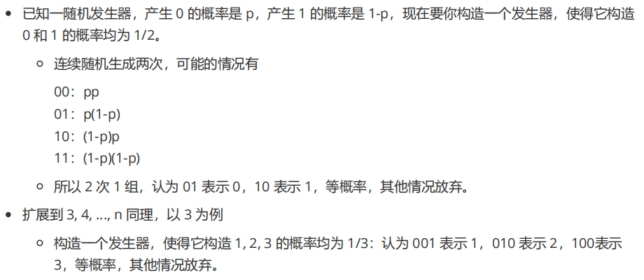

# 概率统计

[toc]

## 1 随机事件的概率

### 1.1 全概率公式和贝叶斯公式 ※※※※※※

- **全概率公式**：由因推果，多种原因造成一个结果，求该结果的概率

  - 文字描述：事件$B_1,B_2,...,B_n$构成**完备事件组**（互不相容且和为全集）​，则A发生的概率为 每个事件的概率 乘以 在这种条件下A发生的条件概率 的加和
    $$
    P(A)=\sum_{i=1}^nP(B_i)P(A|B_i)
    $$

- **贝叶斯公式**：由果推因，已知某结果发生概率，求造成结果的第i个原因的概率

  - **公式**：先用条件概率公式计算，再用全概率公式替换分母
    $$
    \mathrm{P}\left(\mathrm{B}_{{\mathrm{i}}}|\mathrm{A}\right)=\frac{\mathrm{P}\left(\mathrm{A}|\mathrm{B}_{{\mathrm{i}}}\right)\mathrm{P}\left(\mathrm{B}_{i}\right)}{\mathrm{P}\left(\mathrm{A}\right)}=\frac{\mathrm{P}\left(\mathrm{A}|\mathrm{B}_{{\mathrm{i}}}\right)\mathrm{P}\left(\mathrm{B}_{i}\right)}{\sum_{j=1}^{n}P\left(B_{j}\right)\mathrm{P}\left(\mathrm{A}|\mathrm{B}_{j}\right)}
    $$

  - $P(B_i|A)$是后验概率，$P(A|B_i)$是似然度，$P(A)$和$P(B)$是先验概率。

  - **实际意义**：贝叶斯公式将我们对于事件B发生的先验概率和新获得的证据（似然度）相结合，得到给定证据情况下事件B发生的后验概率

  - **应用**：根据已有的训练样本和特征信息，利用贝叶斯公式可以计算出不同类别的后验概率，进行分类任务

### 1.2 联合概率、边缘概率、条件概率 ※※

- **联合概率**：两个事件共同发生的概率：$P(A,B)$
- **边缘概率**：某事件发生的概率，不考虑其他事件的影响：$P(A),P(B)$
- **条件概率**：在B已经发生的条件下，A发生的概率：$P(A|B)$

### 1.3 先验概率、后验概率 ※※※※※

- **先验概率**：事情未发生，根据以往数据得到的概率。是“由因推果”的“因”
- **后验概率**：事情已发生，得到结果后重新修正的概率，是“由果推因”的“因”
- 计算后验概率需要用到先验概率（贝叶斯公式）
- **概率和似然**：概率是给定模型参数后描述结果的合理性；似然是给定观测值后描述模型参数是否合理

### 1.4 独立、不相关 ※※※

- **独立**：$P(A|B)=P(A),P(AB)=P(A)P(B)$
- **不相关**：二者没有**线性关系**。协方差表示两随机变量线性相关性的强度
  - $Cov(X,Y)=E(XY)-EX*EY=0$
- 独立一定不相关，不相关不一定相互独立。若服从二维正态分布，则不相关与独立等价

### 1.5 古典概型和几何概型的区别 ※

- **古典概型**：有限等可能；**几何概型**：无限等可能

## 2 随机变量及其分布

### 2.1 变量与随机变量，随机变量与概率分布 ※※

- **变量**：描述确定性现象，取值固定唯一
- **随机变量**：描述随机现象，取值有多个，各3取值有一定的概率
- 已知一个随机变量的分布函数即可得知该随机变量落在某一区间的概率

### 2.2 正态分布（高斯分布）※※※

$$
概率密度函数\;f(x)=\frac {1}{\sqrt {2\pi }\sigma } \exp(-\frac {(x-\mu )^ {2}}{2\sigma ^ {2}})
$$

- **标准正态分布**：$\mu=0,\sigma=1$
- **应用**：中心极限定理近似某些分布（考试成绩）

- **形状**：两头低，中间高的钟形；**对称性**（关于均值$\mu$对称分布）；**唯一峰值**；定义域无界
- **标准差$\sigma$决定形状**：标准差小则曲线陡峭，标准差大则曲线平缓

### 2.3 若干个正态分布相加/相乘后得到的分布 ※※※※

如果多个随机变量分别服从不同的正态分布，如果这些随机变量彼此独立，那么这些随机变量的和也服从正态分布（线性性质）。成绩为正态分布乘常数

### 2.4 泊松分布、二项分布、超几何分布 ※※

> 概率质量函数就是分布列（离散型随机变量）

- **泊松分布**：常与单位时间（单位面积、单位产品）的技术过程相联系：一天内到达顾客数
  $$
  概率质量函数\;P(X=k)=\frac{\lambda^ke^{-\lambda}}{k!}
  $$
  

  - 其中，$\lambda$是给定时间间隔内发生事件的平均次数（期望），k是该时间间隔内实际发生的事件次数

- **二项分布**：用于描述独立重复试验的成功次数
  $$
  概率质量函数\;P(X=k)=C_n^kp^k(1-p)^{n-k}
  $$

  - 其中，n是实验次数，k是成功次数，p是每次实验成功的概率
  - $n\rightarrow\infin,p\rightarrow0$时，近似为**泊松分布**（$\lambda=np=np(1-p)$）
  - $n\rightarrow\infin$，p不是特别小时，近似为**正态分布**（$\mu=np,\sigma^2=np(1-p)$）

- **超几何分布**：从有限N个物件（包含M个指定种类的物件）中抽出n个物件，成功抽出制定物件的次数（**不放回**）
  $$
  P(X=k)=\frac{C_M^kC_{N-M}^{n-k}}{C_N^n}
  $$

### 2.5 概率密度函数 ※※

- 用来描述**连续性随机变量**的概率分布
- $f(x)\ge0$恒成立，总体积分=1。$EX=\int_{-\infin}^{+\infin} xf(x)dx,DX=\int_{-\infin}^{+\infin} [x-E(x)]^2f(x)dx$
- **不是概率**，乘以区间长度微元是概率近似值。**在一段区间上的积分**就是随机变量X在这段区间上取值的概率

## 3 随机变量的数字特征

### 3.1 期望和方差 ※※

- **期望**：描述随机变量的**集中**特性，随机变量的各**取值与概率的乘积的累加和**

- **方差**：描述随机变量的**离散**特性，随机变量的各取值**减去期望的平方与概率乘积的累加和**
  $$
  \begin{aligned}&\textbf{离散型随机变量:}\\&\text{期望:}\quad E(X)=\sum_{i=1}^nx_ip_i\\&\text{方差:}\quad D(X)=\sum_{i=1}^n\left[x_i-E(X)\right]^2p_i\\&\textbf{连续型随机变量:}\\&\text{期望:}\quad E(X)=\int_{-\infty}^\infty xf(x)\mathrm{d}x\\&\text{方差:}\quad D(X)=\int_{-\infty}^\infty[x-E(X)]^2f(x)\mathrm{d}x\end{aligned}
  $$

### 3.2 协方差和相关系数 ※※※

- **协方差**：每个X减去期望 乘 每个Y减去期望 的期望，表示两个随机变量总体误差的期望

  - 协方差为0，两者**线性不相关（没有线性关系，不是线性无关，也不是无关）**；大于0，正相关；小于0，负相关

  $$
  \begin{aligned}Cov\left(X,Y\right)&=E\left[\left(X-E\left(X\right)\right)\left(Y-E\left(Y\right)\right)\right]\\&=E\left[XY\right]-E\left[X\right]E\left[Y\right]\end{aligned}
  $$

  - $D(X+Y)=DX+DY+2Cov(X+Y)$​
  - n维随机变量$X=[X_1,X_2,...,X_n]^T$的协方差矩阵：$(c_{ij}=cov(X_i,X_j))$

- **相关系数**：协方差除以二者的标准差乘积。是协方差的标准化，取值[-1,1]，无量纲
  $$
  \rho_{X,Y}=\frac{cov\left(X,Y\right)}{\sqrt{D\left(X\right)}\sqrt{D\left(Y\right)}}
  $$

## 4 大数定律和中心极限定理

### 4.1 大数定律 ※※※※

当重复试验的次数很大时，随机变量的**均值**依概率收敛于自己的**期望**（偶然中包含某种必然）

- **意义**：将数理统计的均值和概率论的期望联系在一起

- **切比雪夫大数定律**：随机变量$X_1,X_2,...,X_n$独立，则**样本均值收敛于自己的期望**：
  $$
  \frac{1}{n}\sum_{i=1}^nX_i\stackrel{P}{\to}\frac{1}{n}\sum_{i=1}^nEX_i\\
  切比雪夫不等式:对任意\epsilon\ge0,P(|X-\mu|\ge\epsilon)\le\frac{\sigma^2}{\epsilon^2}
  $$

- **伯努利大数定律**：大量重复试验后随机事件发生的**频率收敛于概率**：
  $$
  \text{对于}X\sim B(n,p),\text{当n很大时有}\frac{X}{n}\stackrel{P}{\to}p
  $$

- **辛钦大数定律**：随机变量$X_1,X_2,...,X_n$独立同分布，n很大时，它们的**算术平均值依概率收敛于期望**：
  $$
  \frac{1}{n}\sum_{i=1}^nX_i\stackrel{P}{\to}\mu
  $$

### 4.2 中心极限定理 ※※※

- **独立同分布中心极限定理**：随机变量$X_1,X_2,...,X_n$独立同分布，期望$EX=\mu$，方差$DX=\sigma^2>0$，当n很大时，则**均值近似服从正态分布**$N(\mu,\sigma^2/n)$​
  - 应用：求随机变量之和$S_n$落在某区间的概率

## 5 极大似然估计 ※※※

**极大似然估计**：利用已知的样本结果，反推最大概率导致这样结果的参数值（根据结果推出参数）

应用：**参数估计**，模型选择，假设检验等

## 6 假设检验 ※※

在总体分布函数未知的情况下，先对总体参数提出一个假设值，然后利用样本信息来判断这一假设是否成立。

- 假设包含原假设和备择假设，二者互补。检验就是对于假设检验问题满足某一**显著性水平**概率的不等式

## 7 其他

### 7.1 机器学习为什么要使用概率？ ※※

- 机器学习是由**数据驱动**的方法，从数据出发提取数据特征抽象数据模型发现知识，最后回到数据的分析和预测
- 机器学习的**算法设计**通常依赖于对数据的**概率假设**
- 机器模型的训练和预测过程的**评价指标**（模型误差）本身就是概率的形式

### 7.2 由不均匀硬币产生等概率 ※※

