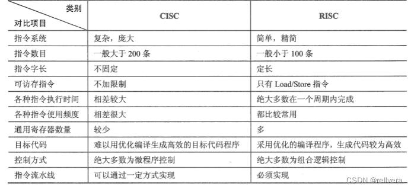

# 计算机组成原理

[toc]

### 1 冯诺依曼机的体系结构 ※※※

主要由5大组件构成：

- **存储器**：用来存放数据和程序：分为主存和辅存
- **运算器**：算术和逻辑运算，将中间结果暂存在运算器中。核心为ALU，还有PSW（程序状态寄存器）
- **控制器**：控制和指挥程序和数据的输入运行，处理运算结果。包括PC（程序计数器）、IR（指令计数器）、CU（控制单元）
- **输入设备**：将程序和数据以机器能够识别的形式输入计算机：鼠标键盘
- **输出设备**：将计算机输处理的结果以人们能理解的形式输出：打印机显示屏
- 运算器+控制器 = CPU

特点：

- 指令和数据**同等地存储在存储器**，由二进制代码表示。**可按地址寻访**。**指令=操作码+地址码**
- 指令在存储器内按序存放，特定条件下可根据运算结果和设定改变顺序。**现代计算机以存储器为核心**

C语言程序翻译四阶段：**预处理**、编译、汇编、**链接**

### 2 衡量计算机性能指标 ※※

- **机器字长**：计算机进行一次整数运算所能处理二进制数据的位数：32位、64位
- **吞吐量**：计算机在某时间间隔内能处理的信息量，字节/秒
- **响应时间**：从输入到系统产生响应之间的时间
- **总线宽度**：CPU中**运算器到存储器**之间互连内部的二进制位数
- **存储器容量**：存储器中所有存储单元的总数目，KB、MB...
- **存储器带宽**：是速度指标，单位时间从存储器读出二进制信息数量，字节/秒

### 3 原码 反码 补码 ※※※

**原码**：首位是符号，其余为值。8位二进制：[-127,127]（1111 1111 - 0111 1111）

**反码**：**正数反码为其本身**，负数反码在其原码基础上，**符号位不变，其余各位取反**

**补码**：**正数补码为其本身**，负数为其**反码+1**

- 例：-3：原码：1000 0011；反码：1111 1100；补码：1111 1101

### 4 存储器的分类 ※※※

- RAM：**随机存取存储器**。与CPU直接交换数据。**可随时读写**，速度快，是OS或程序**临时数据**存储媒介

  > 与ROM相比，最大区别是**断电以后保存的数据会丢失**

  - SRAM：**静态随机存储器**。静止存取，用于关键性系统，速度快，但价格高、功耗大、集成度低
  - DRAM：**动态随机存储器**。**是易失性存储器**，用电容存储数据。只能保存数据很短时间，需要每隔一段时间刷新一次，**最常用**

- ROM：**只读存储器**。装入整机前实现写好，只能读出

- 存储器芯片扩展：位扩展、字扩展、字位同时扩展

### 5 多级存储系统 ※※

解决大容量、高速度、低成本的矛盾。从上至下，价格越来越低、速度越来越慢、容量越来越大

存储系统层次：cache-主存-辅存（磁盘、磁带光盘）

- Cache-主存层：解决**CPU和主存速度不匹配的问题**
- 主存-辅存层：解决**存储系统的容量问题**

### 6 Cache是什么？作用？三种映射方式，多级Cache ※※※※

Cache是高速缓冲存储器（高速缓存），位于CPU和主存DRAM之间。规模小，但速度快，通常由SRAM组成，**性能介于寄存器和DRAM之间**。利用**局部性原理（时间+空间）**，存储最近访问的数据

- **作用**：提高CPU数据输入输出的速率，**解决CPU和主存速度不匹配的问题**。
- **三种映射方式**：
  - **直接映射**：主存每一块只能装入Cache中的唯一位置（块号 mod cache行数），没有置换算法
    - 优点：硬件设计简单，成本低
    - 缺点：冲突概率最高，空间利用率最低，不够灵活
  - **全相联映射**：主存每一块可以装入Cache的任意位置
    - 优点：Cache冲突低（只要有空闲就不冲突），空间利用率和命中率高
    - 缺点：查找比较速度慢，实现成本高，需要额外硬件支持（每个Cache行设置一个**比较器**）
  - **组相联映射**：将Cache分为若干大小相等的组，每个主存块可放入固定组的任意一行。路数大，冲突概率低，但比较电路也复杂，需要权衡。
    - 优点：综合直接映射和全相联映射的优点，既可以减少成本，又能解决冲突
    - 缺点：仍需要在块内进行比较，需要设置好组的数量
- **多级Cache**：L1、L2、L3等多级别缓存，为了提供更高访问速度、命中率、容量和更好性能
- **Cache写更新策略**
  - 写操作命中：
    - **全写法**：CPU对Cache写命中时，**必须把数据同时写入Cache和主存**。实现简单且能保证正确性，但增加访存次数，降低效率。可以设置一个写缓冲
    - **写回法**：CPU对Cache写命中时， 只写入Cache，**只有在此块被替换出时才写回主存**。需要设置脏位标记是否需要写回
  - 写不命中：
    - **写分配法**：更新主存，**然后把主存块调入**Cache。同写回法合用。
    - **非写分配法**：**只更新主存**，不把主存块调入Cache。同全写法合用。

### 7 CPU一个指令周期的流程，五级流水线各阶段 ※※※※※

CPU的功能：

1. **指令控制**：取指令、分析指令、执行指令
2. **操作控制**：完成一条指令所需的操作信号，把操作信号送到相应的部件
3. **时间控制**：控制各种操作信号的出现时间、持续时间、出现顺序
4. **数据加工**：对数据进行算术和逻辑运算
5. **中断处理**：对运行中的异常和中断请求进行处理

CPU**一个指令周期的流程**：

1. **取指**（IF）：从指令寄存器或Cache中取指令
2. **译码**（ID）：操作控制器对指令进行译码，从寄存器堆中取操作数
3. **执行**（EX）：执行运算操作或计算地址
4. **访存**（MEM）：对存储器进行读/写操作
5. **写回**（WB）：将指令执行结果写回寄存器堆

> 执行单条指令，单周期CPU比五级流水CPU更快，因为段与段之间交互更少

流水线冒险

- 数据冒险：前面还没写回，后面就使用
- 结构冒险：硬件还在为前一条指令工作，后面的就要用
- 控制冒险：跳转指令的跳转条件还没算完

### 8 CISC和RISC ※※※

RISC（精简指令系统计算机，硬布线），CISC（复杂指令系统计算机，微程序）

指令数目（CISC多），可访存指令的区别，各种指令执行时间差异，通用寄存器（GPRs）的数量（RISC多)，控制方式（微程序vs组合逻辑），指令流水线是否必须实现（RISC必须）

### 9 总线 ※※

总线是计算机系统中**连接各个硬件组件**的**物理或逻辑通道**。可以传输数据、地址和控制信号，允许不同设备之间**通信和交换信息**

可以传输数据、地址、控制信号、中断

特点：分时、共享

### 10 IO方式 DMA ※※※

IO方式

- **程序查询方式**：程序不断查询IO设备是否已做好准备，从而控制IO设备与主机交换信息。一段时间只能和一台外设交换信息，串行效率低
- **程序中断方式**：在一条指令执行完成后检查是否有中断发生，若有则处理，CPU和外设并行工作
  - 中断需要保护和恢复现场
- **DMA方式**（直接内存访问）：外部设备不通过CPU而**直接与主存进行数据交换**，靠硬件传送
  - DMA控制器发出请求，CPU让出系统总线由DMA接管，让外设可直接访问内存而**无需CPU参与**
  - 好处：提升系统性能，减轻CPU负担，提升数据传输速度

### 11 电脑开机过程

1. 通电，激活CPU读取ROM芯片中的**BIOS**固件
2. 通电自检（**POST**），检查硬件是否有故障
3. 加载**MBR**（主引导记录）
4. MBR加载**bootloader**，将操作系统**内核**从磁盘读入内存，控制权交给内核
5. **操作系统初始化**（内核完成）
6. 启动**用户空间程序**